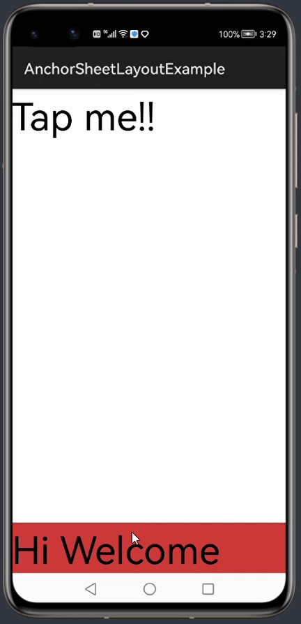

# AnchorSheetBehavior
[](https://jitpack.io/#skimarxall/AnchorSheetBehavior)
[](https://sonarcloud.io/dashboard?id=applibgroup_AnchorSheetBehavior)

AnchorSheetLayout is a custom layout where it can support only one child. It enables the child component container to slide from bottom to top of the screen by revealing the content. So, for adding multiple components add a single layout as a child and add the remaining components as children to that layout.



## Features
Currently, it supports the following features:
* Drag the sheet from bottom to top of the screen.
* Settles in the appropriate position when a fling is delivered to the sheet.
* Provides a call back to the state of the sheet.
* Allows adding unlimited components in the child layout (sheet).
* Able to configure all the possible positions on the screen.
* Able to hide the sheet completely.

## Source
The code in this repository was inspired from [marcelpinto/AnchorSheetBehavior - v1.1](https://github.com/marcelpinto/AnchorSheetBehavior). 
We are very thankful to Mr. Marcelpinto.

## Add AnchorSheetBehavior Dependency
1. For using AnchorSheetBehavior module in sample app, include the source code and add the below dependencies in entry/build.gradle to generate hap/support.har.
```
	dependencies {
		implementation project(':anchorsheetlayout')
        	implementation fileTree(dir: 'libs', include: ['*.har'])
        	testCompile 'junit:junit:4.12'
	}
```
2. For using AnchorSheetBehavior in separate application using har file, add the har file in the entry/libs folder and add the dependencies in entry/build.gradle file.
```
	dependencies {
		implementation fileTree(dir: 'libs', include: ['*.har'])
		testCompile 'junit:junit:4.12'
	}

```
3. For using AnchorSheetBehavior from a remote repository in separate application, add the below dependencies in entry/build.gradle file.
```
	dependencies {
		implementation 'dev.applibgroup:anchorsheetlayout:1.0.0'
		testCompile 'junit:junit:4.12'
	}
```

## Possible states
AnchorSheetLayout has seven different states where five of them are static states and the remaining are dynamic states (states occur when the sheet is moving).
|States|Description|
|:-------------:|:-------------:|
|STATE_EXPANDED|Maximum content on the sheet is shown|
|STATE_HIDDEN|Sheet is not visible|
|STATE_COLLAPSED|Small portion of the sheet is shown|
|STATE_ANCHOR|State between expanded and collapsed|
|STATE_DRAGGING|Sheet is being dragged|
|STATE_SETTLING|Sheet trying to settle in the appropriate position maybe after a fling|
|STATE_FORCE_HIDDEN|Sheet is forced to be hidden irrespective of canHide attribute|

## Attribute meaning
AnchorSheetLayout supports a high degree of customization, and its adjustable attributes and meanings are shown in the table below.

|Attributes  | meaning |
|:-------------:|:-------------:|
|peekHeight|Height of the sheet when in collapsed state|
|minOffset|Distance between Layout Top and Child Top in Hidden State|
|canHide|Says whether Anchor Sheet can go to Hidden State|
|skipCollapsed|Whether to avoid Collapse State when Sheet is moving down|
|anchorThreshold|Fraction which decides the height of the Sheet in Anchor State|


## Using AnchorSheetLayout Library
The GitHub project source includes a sample application, that is used for demonstrating the various features currently supported by this library. Once the library is added to your project, you can include the AnchorSheetLayout into your Slice layout using the following code snippets.
Below DirectionalLayout is added as child.
```xml
<com.hardsoftstudio.anchorsheetlayout.AnchorSheetLayout
   xmlns:ohos="http://schemas.huawei.com/res/ohos"
   ohos:id="$+id:anchorsheet_layout"
   ohos:height="match_parent"
   ohos:width="match_parent"
   app:peekHeight = "200"
   app:anchorThreshold = "0.60"
   app:minOffset = "0"
   app:canHide = "true"
   app:skipCollapsed = "false"
   >
   <DirectionalLayout
       ohos:height="match_parent"
       ohos:width="match_parent"
       ohos:orientation="vertical"
       ohos:background_element="$ohos:color:id_color_alert_dark"
       >
   </DirectionalLayout>
</com.hardsoftstudio.anchorsheetlayout.AnchorSheetLayout>
```
We can set the attributes of the sheet by following java code.
```java
anchorSheetLayout = (AnchorSheetLayout) findComponentById(ResourceTable.Id_anchorsheet_layout);
anchorSheetLayout.setState(AnchorSheetLayout.STATE_COLLAPSED);
anchorSheetLayout.setCanHide(true);
```
We can set the call back to the sheet by the following code. Below onStateChanged method is called whenever the state of the sheet change and onSlide method gives the slide amount.

```java
anchorSheetLayout.setAnchorSheetCallback(new AnchorSheetLayout.AnchorSheetCallback() {
   
   @Override
   public void onStateChanged(Component bottomSheet, @AnchorSheetLayout.State int newState) {
       // some code
       }
   }

   @Override
   public void onSlide(Component bottomSheet, float slideOffset) {
       // some code
   }
});
```

License
=======

    Copyright 2015 Marcel Pintó Biescas

    Licensed under the Apache License, Version 2.0 (the "License");
    you may not use this file except in compliance with the License.
    You may obtain a copy of the License at

       http://www.apache.org/licenses/LICENSE-2.0

    Unless required by applicable law or agreed to in writing, software
    distributed under the License is distributed on an "AS IS" BASIS,
    WITHOUT WARRANTIES OR CONDITIONS OF ANY KIND, either express or implied.
    See the License for the specific language governing permissions and
    limitations under the License.
